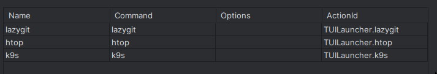
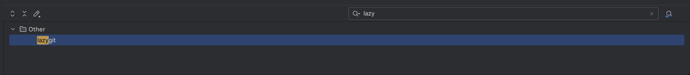
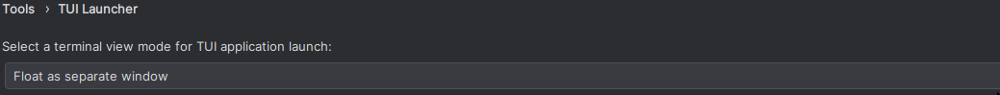

# TUILaunch


[](https://plugins.jetbrains.com/plugin/MARKETPLACE_ID)
[](https://plugins.jetbrains.com/plugin/MARKETPLACE_ID)

## Template ToDo list
- [x] Create a new [IntelliJ Platform Plugin Template][template] project.
- [ ] Get familiar with the [template documentation][template].
- [ ] Adjust the [pluginGroup](./gradle.properties) and [pluginName](./gradle.properties), as well as the [id](./src/main/resources/META-INF/plugin.xml) and [sources package](./src/main/kotlin).
- [ ] Adjust the plugin description in `README` (see [Tips][docs:plugin-description])
- [ ] Review the [Legal Agreements](https://plugins.jetbrains.com/docs/marketplace/legal-agreements.html?from=IJPluginTemplate).
- [ ] [Publish a plugin manually](https://plugins.jetbrains.com/docs/intellij/publishing-plugin.html?from=IJPluginTemplate) for the first time.
- [ ] Set the `MARKETPLACE_ID` in the above README badges. You can obtain it once the plugin is published to JetBrains Marketplace.
- [ ] Set the [Plugin Signing](https://plugins.jetbrains.com/docs/intellij/plugin-signing.html?from=IJPluginTemplate) related [secrets](https://github.com/JetBrains/intellij-platform-plugin-template#environment-variables).
- [ ] Set the [Deployment Token](https://plugins.jetbrains.com/docs/marketplace/plugin-upload.html?from=IJPluginTemplate).
- [ ] Click the <kbd>Watch</kbd> button on the top of the [IntelliJ Platform Plugin Template][template] to be notified about releases containing new features and fixes.

<!-- Plugin description -->
**TUILaunch** is helps to launching TUI applications, such as `lazygit`, within IntelliJ's built-in terminal.
Every saved application launch command is assigned an auto generated Action,
which seamlessly integrate with IdeaVim or work  with the built-in keymap.


The plugin is  inspired by Neovim's  [ToggleTerm plugin](https://github.com/akinsho/toggleterm.nvim?tab=readme-ov-file#custom-terminals) custom terminal feature.

<!-- Plugin description end -->

## Features
You can open the settings and add/edit commands :
<kbd>Settings/Preferences</kbd> > <kbd>Tools</kbd> > <kbd>TUILauncher</kbd>

### Create Action for TUI app 
Add an installed application to the table, and after saving it, an action with the format `TUILauncher.{name}` is added to the IDE Actions.



You can use the **ActionId** in IdeaVim:
```
nmap <Space>gg <Action>(TUILauncher.lazygit)
```

Or simply use the built-in keymap feature.


> After you close the TUI app, the terminal session automatically ends because the executed command always follows this format: `${command};exit.`
> 
###  ToolWindowType
Configure which tool window mode is used to open your TUI app.



#### Override Modes
When opening a terminal tool window, the current tool window type is temporarily overridden, and the terminal opens in the selected mode. 

Available modes:
- `Dock to IDE window edge` – Attaches the terminal to the edge of the IDE window.
- `Float as a separate window` – Opens the terminal in a floating window.
- `Slide over the editor area` – Displays the terminal as an overlay on the editor.
- `Show in a detached window` – Opens the terminal in a fully separate window.

> After the focus is lost, the tool window type automatically reverts to its default state.

#### Does not override the mode:
-  `Use current window mode` – Keeps the existing tool window mode unchanged.

#### Limitation
- Terminal sessions handled by this plugin are automatically closed after focus is lost.
- Only one TUI application can be launched at a time. If you open a new app while another TUI application is running, the previous one is automatically closed.


## Installation

- Using the IDE built-in plugin system:
  
  <kbd>Settings/Preferences</kbd> > <kbd>Plugins</kbd> > <kbd>Marketplace</kbd> > <kbd>Search for "TUILaunch"</kbd> >
  <kbd>Install</kbd>
  
- Using JetBrains Marketplace:

  Go to [JetBrains Marketplace](https://plugins.jetbrains.com/plugin/MARKETPLACE_ID) and install it by clicking the <kbd>Install to ...</kbd> button in case your IDE is running.

  You can also download the [latest release](https://plugins.jetbrains.com/plugin/MARKETPLACE_ID/versions) from JetBrains Marketplace and install it manually using
  <kbd>Settings/Preferences</kbd> > <kbd>Plugins</kbd> > <kbd>⚙️</kbd> > <kbd>Install plugin from disk...</kbd>

- Manually:

  Download the [latest release](https://github.com/atm1020/TUILaunch/releases/latest) and install it manually using
  <kbd>Settings/Preferences</kbd> > <kbd>Plugins</kbd> > <kbd>⚙️</kbd> > <kbd>Install plugin from disk...</kbd>


---
Plugin based on the [IntelliJ Platform Plugin Template][template].

[template]: https://github.com/JetBrains/intellij-platform-plugin-template
[docs:plugin-description]: https://plugins.jetbrains.com/docs/intellij/plugin-user-experience.html#plugin-description-and-presentation
